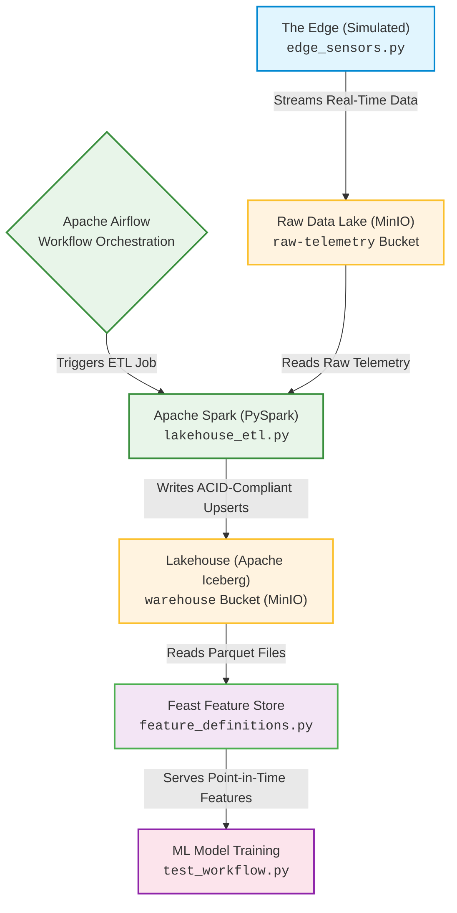

# IoT Modern Lakehouse & ML Feature Store


## Project Overview
This project simulates a manufacturing company managing thousands of IoT sensors generating massive volumes of telemetry data every hour. The goal was to build a cost-effective, highly reliable process to store raw data and refine it into AI-ready features. 

Instead of relying on managed cloud services, this project is a **100% local, zero-cost architecture**. It demonstrates a deep, low-level understanding of how distributed tools (Spark, Iceberg, Feature Stores) connect and configure manually.

## Tech Stack
* **Storage Layer:** MinIO (Local S3-compatible Object Storage) 
* **Compute Engine:** Apache Spark / PySpark 3.5.1 (Official Apache Docker Image) 
* **Table Format:** Apache Iceberg (providing ACID transactions and Time Travel) 
* **MLOps Feature Store:** Feast (Open-Source feature registry and serving) 
* **Infrastructure:** Docker & Docker-Compose 
* **Languages & Libraries:** Python, `boto3`, `pandas`, `dask`, `s3fs` 

## Architecture Flow

## Core Engineering Challenges Overcome
* **Iceberg Time Travel & Schema Evolution:** Navigated Iceberg's metadata versioning and resolved `KeyError` schema mismatches during point-in-time feature extraction by managing Iceberg's snapshot retention. Guaranteed "Point-in-Time Correctness" for ML models by ensuring all feature writes included an `event_timestamp`.
* **Zero-Cost Local Infrastructure:** Bypassed deprecated vendor Docker registries (Bitnami) by configuring the official `apache/spark:3.5.1` images directly, ensuring native multi-architecture support (Apple Silicon compatibility).
* **Complex S3 Routing for MLOps:** Successfully rerouted Feast's underlying AWS SDK (`boto3`/`pyarrow`) to target the local MinIO container instead of Amazon Cloud servers by configuring environment variables (`.env`) and installing the `s3fs` adapter for Dask/Pandas.

## How to Run Locally

**1. Clone the repository**
```bash
git clone https://github.com/rtmagar/iot-lakehouse-feature-store.git
cd iot-lakehouse-feature-store
```
**2. Start the Infrastructure**
```bash
docker-compose up -d
```
*Access MinIO at http://localhost:9001 and Spark UI at http://localhost:8080.*

**3. Generate IoT Telemetry**
```bash
python edge_sensors.py
```
*Streams mock sensor data into the ```raw-telemetry``` bucket.*

**4. Run the PySpark ETL**
```bash
python lakehouse_etl.py
```
*Processes the JSON, engineers ML features, and commits an ACID-compliant Iceberg table to the ```warehouse``` bucket.*

**5. Serve Features for ML (Feast)**
```bash
cd feature_repo/feature_repo
source .env
feast apply
python test_workflow.py
```
*Returns an AI-ready Pandas DataFrame with historically accurate features for predictive maintenance model training.*
